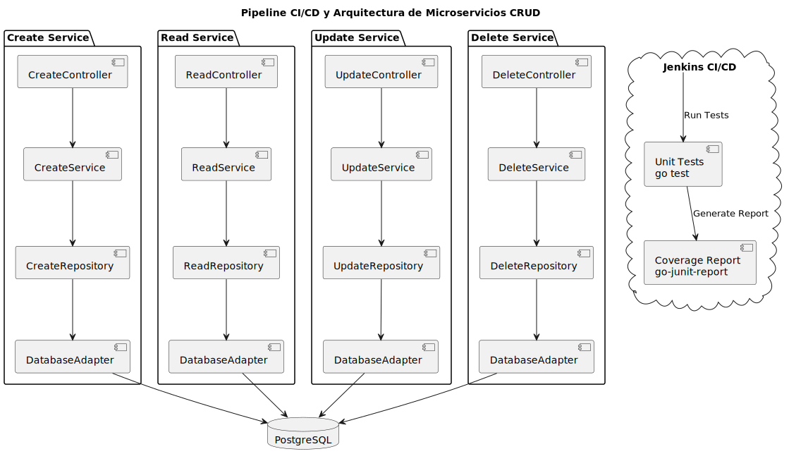

<h1 align="center">
  <i class="fa-solid fa-beer-mug-empty"></i>
  Beer API - Microservicios en Go
</h1>

  Sistema de gestión de cervezas basado en microservicios, desarrollado en Go (Gin) y MongoDB,
  orquestado con Docker y Docker Compose.

  
  
  
  

<h2>
  <i class="fa-solid fa-circle-info"></i>
  Descripción del proyecto
</h2>

  <strong>Beer API</strong> es un sistema de microservicios diseñado para gestionar un catálogo de cervezas.
  Cada microservicio se encarga de una responsabilidad específica (crear, actualizar, etc.) y se comunica con
  una base de datos <strong>MongoDB</strong> centralizada.

<ul>
  <li><i class="fa-solid fa-microchip"></i> Backend implementado en <strong>Go</strong> usando el framework <strong>Gin</strong>.</li>
  <li><i class="fa-solid fa-database"></i> Persistencia de datos en <strong>MongoDB</strong>.</li>
  <li><i class="fa-brands fa-docker"></i> Contenedores gestionados mediante <strong>Docker</strong> y <strong>Docker Compose</strong>.</li>
  <li><i class="fa-solid fa-cubes"></i> Arquitectura basada en <strong>microservicios</strong>.</li>
</ul>

<h2>
  <i class="fa-solid fa-users"></i>
  Integrantes del proyecto
</h2>

<ul>
  <li><strong>DAVID MANTILLA AVILES</strong></li>
  <li><strong>SANTIAGO PALACIO VASQUEZ</strong></li>
</ul>

<h2>
  <i class="fa-solid fa-users"></i>
  Diagrama de Infrastructura
</h2>

  

<h2>
  <i class="fa-solid fa-folder-tree"></i>
  Estructura del proyecto
</h2>

<pre>
beer-api-go/
├── create-service/          # Microservicio de creación
│   ├── cmd/
│   │   └── main.go          # Punto de entrada del servicio
│   ├── internal/
│   │   ├── controllers/     # Controladores HTTP (Gin handlers)
│   │   ├── db/              # Adaptadores de base de datos
│   │   ├── models/          # Modelos y estructuras de datos
│   │   ├── repository/      # Capa de repositorio
│   │   └── services/        # Lógica de negocio
│   ├── Dockerfile
│   └── go.mod
├── read-service/            # Microservicio de consulta
│   ├── cmd/
│   │   └── main.go          # Punto de entrada del servicio
│   ├── internal/
│   │   ├── controllers/     # Controladores HTTP (Gin handlers)
│   │   ├── db/              # Adaptadores de base de datos
│   │   ├── models/          # Modelos y estructuras de datos
│   │   ├── repository/      # Capa de repositorio
│   │   └── services/        # Lógica de negocio
│   ├── Dockerfile
│   └── go.mod
├── update-service/          # Microservicio de actualización
│   ├── cmd/
│   │   └── main.go          # Punto de entrada del servicio
│   ├── internal/
│   │   ├── controllers/     # Controladores HTTP (Gin handlers)
│   │   ├── db/              # Adaptadores de base de datos
│   │   ├── models/          # Modelos y estructuras de datos
│   │   ├── repository/      # Capa de repositorio
│   │   └── services/        # Lógica de negocio
│   ├── Dockerfile
│   └── go.mod
├── delete-service/          # Microservicio de eliminación
│   ├── cmd/
│   │   └── main.go          # Punto de entrada del servicio
│   ├── internal/
│   │   ├── controllers/     # Controladores HTTP (Gin handlers)
│   │   ├── db/              # Adaptadores de base de datos
│   │   ├── models/          # Modelos y estructuras de datos
│   │   ├── repository/      # Capa de repositorio
│   │   └── services/        # Lógica de negocio
│   ├── Dockerfile
│   └── go.mod
├── docker-compose.yml       # Orquestación de contenedores
├── .env                     # Variables de entorno
├── .env.example             # Ejemplo de archivo .env
└── README.md
</pre>

<h2>
  <i class="fa-solid fa-gears"></i>
  Requisitos previos
</h2>

<ul>
  <li><i class="fa-brands fa-docker"></i> <strong>Docker</strong> instalado.</li>
  <li><i class="fa-brands fa-docker"></i> <strong>Docker Compose</strong> instalado.</li>
  <li><i class="fa-brands fa-golang"></i> <strong>Go 1.x</strong> (opcional para desarrollo local sin contenedores).</li>
  <li><i class="fa-solid fa-key"></i> Acceso al repositorio (GitHub / Bitbucket) por SSH o HTTPS.</li>
</ul>

<h2>
  <i class="fa-solid fa-file-lines"></i>
  Variables de entorno
</h2>

Archivo <code>.env</code> (ubicado al mismo nivel que <code>docker-compose.yml</code>):

<pre>
MONGO_URI=mongodb://mongodb:27017
DATABASE=beersdb
COLLECTION=beers
</pre>

  Estas variables son utilizadas por los microservicios para conectarse a la base de datos MongoDB.
  <strong>Nota:</strong> El hostname debe coincidir con el nombre del contenedor de MongoDB definido en <code>docker-compose.yml</code> (<code>mongodb</code>).

<h2>
  <i class="fa-solid fa-play"></i>
  Cómo ejecutar el proyecto
</h2>

<ol>
  <li>
    <strong>Clonar el repositorio desde GitHub</strong>
    <pre>git clone https://github.com/dvdm12/beer-api-go.git</pre>
    <strong>O desde Bitbucket</strong>
    <pre>git clone git@bitbucket.org:team-development1/beer-api.git</pre>
    <pre>cd beer-api-go</pre>
  </li>
  <li>
    <strong>Crear el archivo <code>.env</code></strong> en la raíz del proyecto con el siguiente contenido:
    <pre>
MONGO_URI=mongodb://mongodb:27017
DATABASE=beersdb
COLLECTION=beers
    </pre>
  </li>
  <li>
    <strong>Levantar los contenedores con Docker Compose</strong>
    <pre>docker compose up -d</pre>
    
Esto iniciará MongoDB y los microservicios.

  </li>
  <li>
    <strong>Verificar contenedores en ejecución</strong>
    <pre>docker compose ps</pre>
    
Deberías ver cinco contenedores activos:

    <ul>
      <li><code>mongodb</code> - Base de datos MongoDB (Puerto 27017)</li>
      <li><code>create_service</code> - Servicio de creación (Puerto 8080)</li>
      <li><code>read_service</code> - Servicio de consulta (Puerto 8081)</li>
      <li><code>update_service</code> - Servicio de actualización (Puerto 8082)</li>
      <li><code>delete_service</code> - Servicio de eliminación (Puerto 8083)</li>
    </ul>
  </li>
  <li>
    <strong>Verificar logs de los microservicios</strong>
    <pre>docker logs create_service
docker logs read_service
docker logs update_service
docker logs delete_service</pre>
  </li>
</ol>

<h2>
  <i class="fa-solid fa-plug"></i>
  Endpoints
</h2>

<strong>Create Service</strong> (Puerto 8080):

<ul>
  <li>
    <code>POST /beers</code> – Crear una nueva cerveza.
    <pre>
curl -X POST http://localhost:8080/beers \
  -H "Content-Type: application/json" \
  -d '{
    "name": "Heineken",
    "brand": "Heineken",
    "alcohol": 5.0,
    "year": 2024
  }'
    </pre>
  </li>
</ul>

<strong>Read Service</strong> (Puerto 8081):

<ul>
  <li>
    <code>GET /beers</code> – Obtener todas las cervezas.
    <pre>curl http://localhost:8081/beers</pre>
  </li>
  <li>
    <code>GET /beers/:id</code> – Obtener una cerveza específica por ID.
    <pre>curl http://localhost:8081/beers/BEER_ID</pre>
  </li>
</ul>

<strong>Update Service</strong> (Puerto 8082):

<ul>
  <li>
    <code>PUT /beers/:id</code> – Actualizar una cerveza existente.
    <pre>
curl -X PUT http://localhost:8082/beers/BEER_ID \
  -H "Content-Type: application/json" \
  -d '{
    "name": "Heineken Premium",
    "brand": "Heineken International",
    "alcohol": 5.2,
    "year": 2025
  }'
    </pre>
  </li>
</ul>

<strong>Delete Service</strong> (Puerto 8083):

<ul>
  <li>
    <code>DELETE /beers/:id</code> – Eliminar una cerveza por ID.
    <pre>curl -X DELETE http://localhost:8083/beers/BEER_ID</pre>
  </li>
</ul>

<strong>Modelo de datos Beer:</strong>

<pre>
{
  "name": string,      // Nombre de la cerveza
  "brand": string,     // Marca de la cerveza
  "alcohol": float,    // Contenido de alcohol
  "year": int          // Año
}
</pre>

<h2>
  <i class="fa-solid fa-code-branch"></i>
  Flujo de trabajo con Git
</h2>

<ol>
  <li>Crear rama de trabajo desde <code>develop</code>:</li>
</ol>

<pre>git checkout develop
git pull origin develop
git checkout -b feature/nueva-funcionalidad</pre>

<ol start="2">
  <li>Realizar cambios, commitear y pushear:</li>
</ol>

<pre>
git add .
git commit -m "Descripción clara de los cambios"
git push origin feature/nueva-funcionalidad
</pre>

<ol start="3">
  <li>Crear Pull Request hacia <code>develop</code> preferiblemente desde GitHub ya que ahí tenemos workflows de CI/CD configurados.</li>
</ol>

<h2>
  <i class="fa-solid fa-clipboard-check"></i>
  Estado actual
</h2>

<ul>
  <li>✅ Microservicio <strong>create-service</strong> (Puerto 8080).</li>
  <li>✅ Microservicio <strong>read-service</strong> (Puerto 8081).</li>
  <li>✅ Microservicio <strong>update-service</strong> (Puerto 8082).</li>
  <li>✅ Microservicio <strong>delete-service</strong> (Puerto 8083).</li>
  <li>✅ <code>docker-compose.yml</code> configurado para orquestar servicios y base de datos.</li>
  <li>✅ Tests unitarios implementados para todos los servicios.</li>
  <li>✅ Arquitectura estandarizada con adaptadores, repositorios, servicios y controladores.</li>
  <li>✅ Repositorios de GitHub y Bitbucket configurados.</li>
  <li>✅ Workflows de CI/CD con GitHub Actions.</li>
</ul>

<h3>
  <i class="fa-solid fa-flask"></i>
  Ejecutar tests
</h3>

<strong>Create Service:</strong>

<pre>cd create-service && go test ./... -v</pre>

<strong>Read Service:</strong>

<pre>cd read-service && go test ./... -v</pre>

<strong>Update Service:</strong>

<pre>cd update-service && go test ./... -v</pre>

<strong>Delete Service:</strong>

<pre>cd delete-service && go test ./... -v</pre>

<h2>
  <i class="fa-solid fa-handshake-angle"></i>
  Contribuciones
</h2>

  <em>Proyecto desarrollado por <strong>DAVID MANTILLA AVILES</strong> y <strong>SANTIAGO PALACIO VASQUEZ</strong>.</em>

